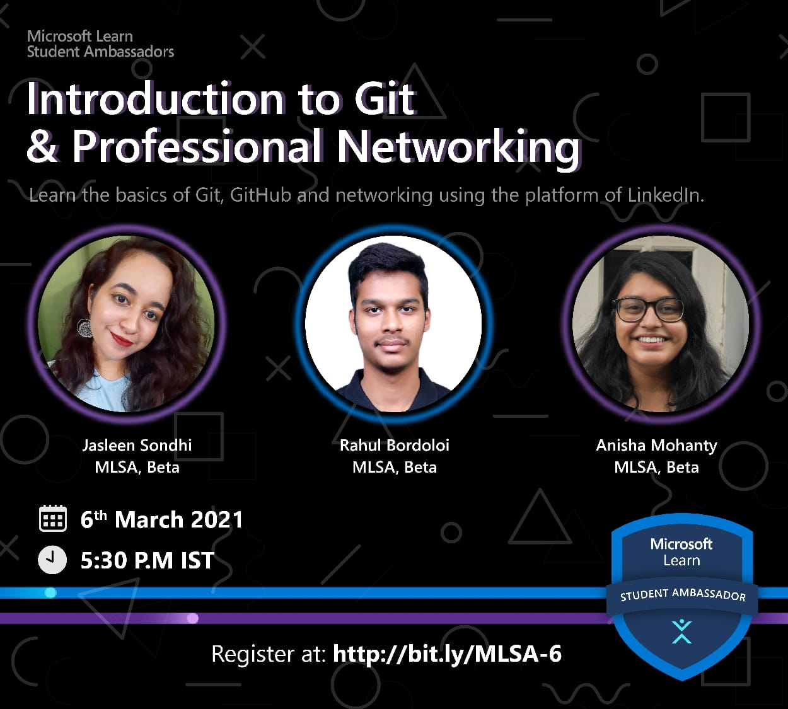

# MLSA - Introduction to Git and Professional Networking

You'll find all the materials and files used in the session here. Do contact anyone from below for any queries. 

## Links

Workshop Presentation Link: 
 - [Introduction to VCS, Git and Github](https://github.com/rahulbordoloi/MLSA---Introduction-to-Git-and-Professional-Networking/blob/master/Introduction%20to%20VCS%2C%20Git%20and%20Github.pptx)  
 - [Professional Networking](https://github.com/rahulbordoloi/MLSA---Introduction-to-Git-and-Professional-Networking/blob/master/Professional%20Networking.pptx)  
 - [Stduent Developer Pack](https://github.com/rahulbordoloi/MLSA---Introduction-to-Git-and-Professional-Networking/blob/master/GitHub%20Student%20Developer%20Pack.pptx)  
 
Meeting Recording Link: [One Drive Link]() (Yet to be Uploaded)

## Organizers

Name : __Rahul Bordoloi__  
Website : https://rahulbordoloi.me  
Email : rahulbordoloi24@gmail.com, rahul.bordoloi@studentambassadors.com  

Name : __Jasleen Sondhi__  
Email : jasleensondhi@gmail.com, jasleen.sondhi@studentambassadors.com  

Name : __Anisha Mohanty__  
Email : anishamohanty100@gmail.com, anisha.mohanty@studentambassadors.com  
